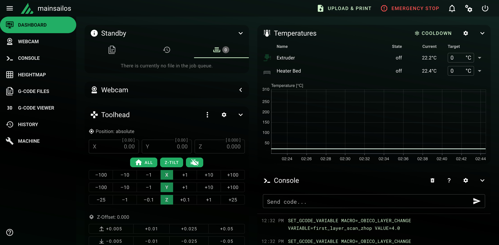

# Mainsail-Green-Acryl
A Mainsail dark theme with green accents and acrylic effects.
Based on [acryl-fluidd-mainsail-theme by eliteSchwein](https://github.com/eliteSchwein/acryl-fluidd-mainsail-theme/tree/main) and animated background from [mainsail-theme-elegance by Turbine1991](https://github.com/Turbine1991/mainsail-theme-elegance).



## Installation
1. Clone the `custom.css` from this repo:
```bash
git clone https://github.com/tui2019/Mainsail-Green-Acryl ~/printer_data/config/.theme
```
2. Go to ***Settings*** -> ***UI-Settings*** and set ***Logo*** color to `39, 174, 96` and ***Primary*** color to `208, 243, 204`.
<br><br>
Additionally you can change colors of the temparature graph by clicking on ***Extruder*** and ***Heater Bed***. The colors in hex are `#27AE5F` for extruder and `#D0F3CE` (Light Green) or `#FFFFFF` (White, as on the screenshot).
